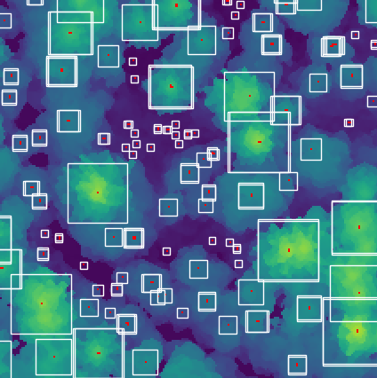

# treeseg

[](https://treeseg.readthedocs.io/en/latest/?badge=latest)

A library of tree segmentation and detection algorithms.

For general LiDAR processing tasks (e.g. normalization, canopy height models, etc.) please see [pyfor](https://github.com/brycefrank/pyfor).

## Current Status

`treeseg` is currently under development.

## Planned and Current Algorithms

### Detection

- [x] `FixedWindowLocalMaxima`
- [x] `VariableWindowLocalMaxima`



### Segmentation

- [x] `Vornoi`
- [ ] `Watershed`

Please send your suggestions to the [issues](https://github.com/brycefrank/treeseg/issues) board.

## Requirements

```
- skimage
- pyproj
- rasterio
- scipy
- geopandas
```

## Installation

Forthcoming.